<html lang="en">

<head>
<meta charset="UTF-8">
<meta http-equiv="X-UA-Compatible" content="IE=edge">
<meta name="viewport" content="width=device-width, initial-scale=1.0">

</head>

<body>

<h1>
Unsupervised Machine Learning Project For Fitness Data Clustering & PCA</h1>

<h2>General Information About The Project: </h2>

<ul>

<li>The project is written in Python in a Jupyter Notebook format</li>
<li>The motivation behind the dataset is to produce a machine learning model that can categorize people based on their fitness data </li>
<li>The used data contains multiple features therefore Principal Component Analysis (PCA) is used to decrease the number of features for visualization purposes</li>

<li>The dataset behind the project is available from kaggle.com <a
href="https://www.kaggle.com/datasets/kukuroo3/body-performance-data"> Dataset Link
</a>
<li>The purpose of the dataset is to cluster people based on their fitness perfromance</li>

<li>The project initially starts by conducting EDA in preprocessing.ipynb file</li>
<li>The second part of the project conducts the unsupervised ML analysis in maincode.ipynb </li>

</ul>

<h2>EDA Conclusions Written Information: </h2>

<ul>
<li>There is a total of <b>12</b> features which are: </li>
<ul>
<li><b>Age</b>, the age in years</li>
<li><b>Gender</b>, the gender and it is presented as male or female </li>
<li><b>Height</b>, the height of people in cm  </li>
<li><b>Weight</b>, the weight of people in kg</li>
<li><b>Bodyfat</b>, the body fat percentage of people in % </li>
<li><b>Diastolic</b>,this is the diastolic blood pressure, measures the pressure in your arteries when your heart rests between beats per min</li>
<li><b>Systolic</b>, this is the systolic blood pressure, measures the pressure in your arteries when your heart beats per min </li>
<li><b>Gribforce</b>, the gribforce in kg</li>
<li><b>Sit and Bend Forward</b>, the sit and bend forward movement in cm </li>
<li><b>Sit-up</b>, The sit-ups as a count number for each person</li>
<li><b>Broad jump</b>, the broad jump in cm</li>
<li><b>Class</b>, it is a performance measure either A, B, C, or D. The data’s author did not specify the metric. But based on the detailed EDA I believe that Class A is the best and Class D is the worst</li>

</ul>

</ul>

<h2>EDA Scatter Plots: </h2>

<ul>

<li>A count plot of the male and female counts in the gender's feature </li>
<ul>
<li>The data between males and females is not fully balanced. There are 8467 males and 4926 females</li>

   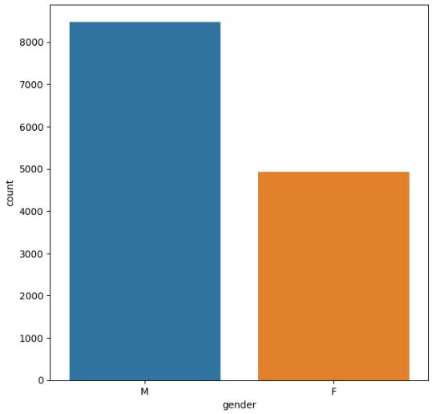   

</ul>

<li>A count plot of the four performance classes in the class feature</li>
<ul>
<li>The data between the different classes of performance is balanced. The data's author did not specify the evaluation measurements for this feature. However,
during the extensive EDA it was indicated that class A meant to be the class with the highest performance and class D is the class with the lowest performance</li>

   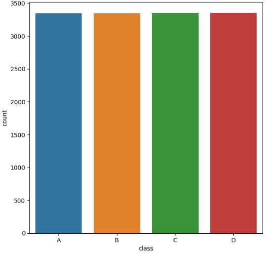   

</ul>

<li>A scatter plot of the age and the height. Gender is set as hue and the different classes are shown in unique styles</li>
<ul>
<li>Majority of males and taller than females </li>
<li>The data is balanced between males and females when it comes to age </li>
<li>The distrubtion of performance A,B,C and D is balanced for both males and females  </li>

   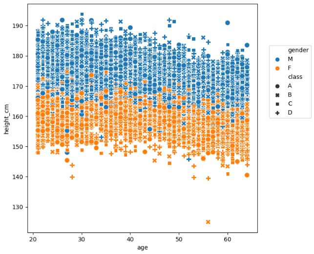   

</ul>

<li>A scatter plot of the age and the weight. Gender is set as hue and the different classes are shown in unique styles</li>
<ul>
<li>Males are heavier than females  </li>
<li>At the highest weight of males the performance seem to be lowest which is class D. This could indicate that high weight refer to poor perfromancee </li>

   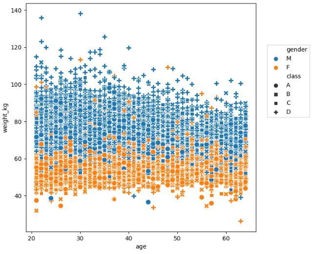   

</ul>

<li>A scatter plot of the age and the body fat percentage. Gender is set as hue and the different classes are shown in unique styles</li>
<ul>
<li>There is one male outlier who has a fat percentage of 78.4%. The rest of males and females have a fat percentage of 50 or below   </li>
<li>Females have higher fat percentage than males  </li>
<li>When it comes to perfromance females with the higher fat percentage seem to have a class D perfromance which indicates a low level of performance   </li>
<li>Males and females have classes of A or B and few have class of C when the fat percentage decreases indicating increase in perfromance when the fat percentage is low  </li>

   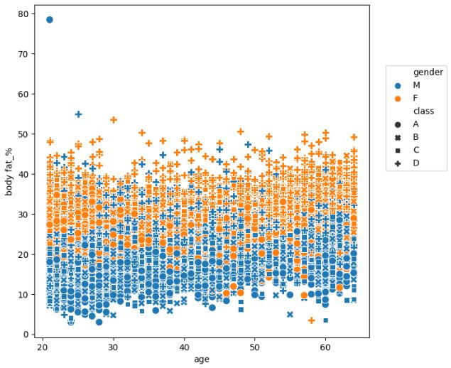   

</ul>

<li>A scatter plot of the age and the diastolic rate. Gender is set as hue and the different classes are shown in unique styles</li>
<ul>
<li>There seem to be more females with lower diastolic rate than males   </li>

   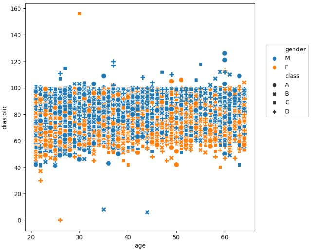   

</ul>

<li>A scatter plot of the age and the systolic rate. Gender is set as hue and the different classes are shown in unique styles</li>
<ul>
<li>There seem to be more females with lower systolic rate than males   </li>

   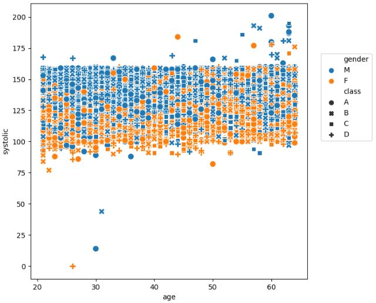   

</ul>

<li>A scatter plot of the age and the sit and bend forward distance. Gender is set as hue and the different classes are shown in unique styles</li>
<ul>
<li>There are couple male outliers for the sit and bend forward distance in cm which are above 150 cm and of different classes of perfroamnce (A and B)   </li>
<li>The majoirty of males and females have a sit and bend forward distance below 50 cm   </li>
<li>Females seem to be on the higher end when it comes to the sit and bend forward distance   </li>

   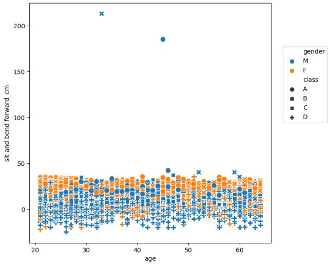   

</ul>

<li>A scatter plot of the age and the broad jump distance. Gender is set as hue and the different classes are shown in unique styles</li>
<ul>
<li>Males seem to be doing higher jumps than females    </li>
<li>Females and males with the lowest jumps tend to be assigned the lowest perfromance classes of classes C & D and vice versa   </li>
<li>When it comes to age the older people get the lower they can jump  </li>

   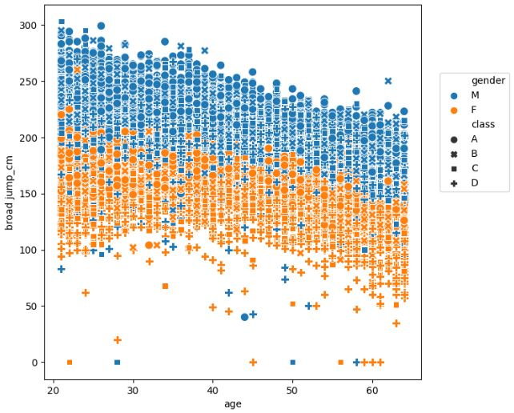   

</ul>

<li>A scatter plot of the weight and the body fat percentage. Gender is set as hue and the different classes are shown in unique styles</li>
<ul>
<li>There is a linear relationship between weight and body fat percentage increasing the weight also increases the body fat percentage as expected </li>
<li>People with higher weight and body fat percentage tend to belong to the class D   </li>
<li>There is an outlier that has a weight of 80 and fat percentage of 80  </li>

   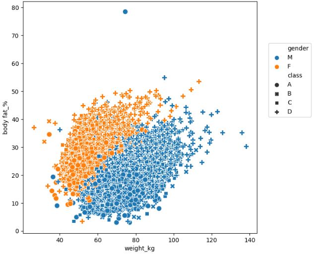   

</ul>

<li>A scatter plot of the situps count and the broad jump distance. Gender is set as hue and the different classes are shown in unique styles</li>
<ul>
<li>There is a linear relationship between situps and the broad jump     </li>
<li>People with higher sit up counts have higher broad jump and vice versa    </li>
<li>People with the highest broad jump and situps tend to belong to class A  </li>

   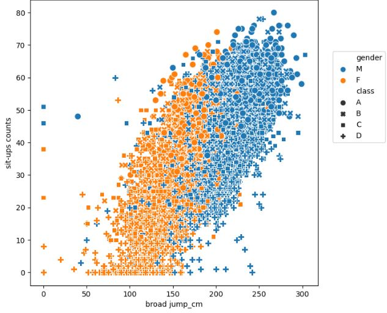   

</ul>

<li>A pair plot of all the features. Gender is set as hue</li>
<ul>
<li>The pairplot contains 10x10 plots which is 100 plots. Below we will highlight interesting points from selected plots     </li>
<li>For the height & weight there is a linear relationshop between these two paramters. Males on an average have higher weight and height  </li>
<li>For the for height and broad jump there is a linear relationship. Meaning taller people have the ability to jump higher  </li>
<li>For the weight males are heavier than females on average  </li>
<li>For the body fat % males have higher bf % than females  </li>
<li>For the gripforce & height, there is a linear relationship in which taller people have higher grip force </li>
<li>For the gripforce & weight, there is a linear relationship in which heavier people have higher grip force </li>

<li>Males have higher grip force than females. Moreover, people with lower fat percentage tend to have higher gripforce  </li>
<li>Gripforce and broad jump seem to have a linear relationshop. people with higher jump also have higher gripforce   </li>
<li>People with higher sit up counts tend to have higher broad jump and people with lower body fat percentage have a higher broad jump </li>

   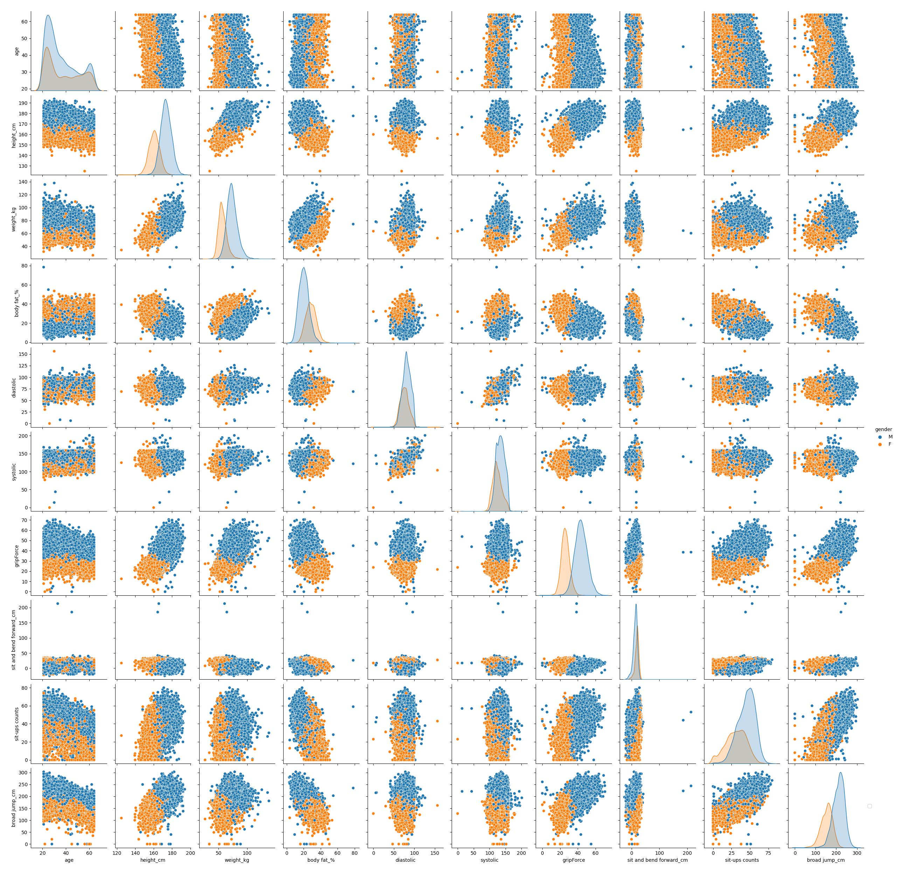   

</ul>

</ul>

<h2>Conclusions: </h2>

<ul>
<li>      The K-Means Clustern Algorithm was able to categorize data based on the K value
</li>
<li>      After conducting EDA the "Elbow Method" was used to analyze specific values of K. Namely K = 10
</li>

   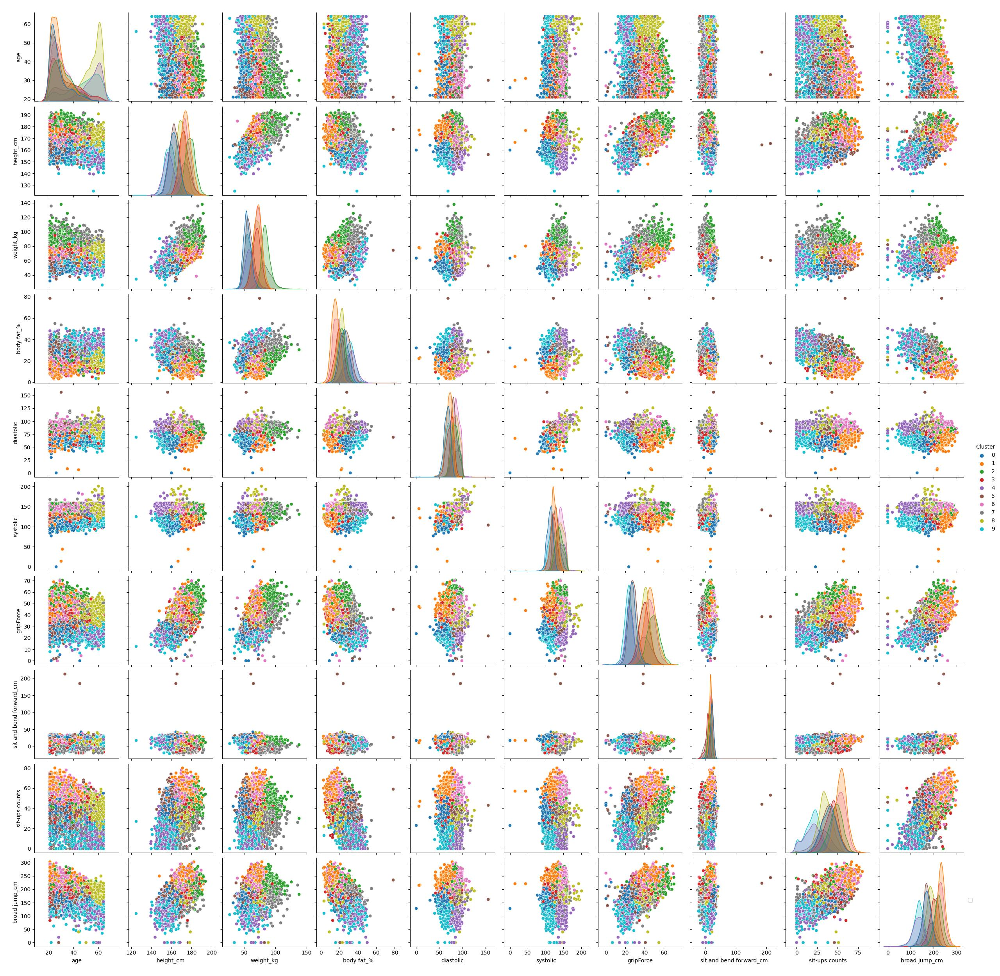   

<li>     <b>   When K = 10 it is difficult to build up a conclusion on the meaning on the clustered data. Which is why PCA is needed to be employed. However, based on viewing the data the following can be concluded </b>
</li>
<ul>
<li>    Cluster 0: The dark blue this cluster seems to be merged with the other clusters and it difficult to come up with a conclusion for it
</li>
<Li>
Cluster 1: The orange cluster this cluster seems to be on the:

<ul>
<li>
Low-end on the body fat percentage, diastolic rate, systolic rate
</li>
<li>
Mid-end on the age, weight, sit and bend forward distance
</li>
<li>
High-end on the height, grip force, sit-ups, broad jumps
</li>
</ul>

</Li>
<Li>
Cluster 2: The green cluster
<ul>
<li>
Mid-end on the age, body fat percentage, diastolic rate, systolic rate, sit and bend forward
</li>
<li>
High-end on the hight, weight, grip force, situps, broad jump
</Li>
</li>
</ul>

<Li>
Cluster 3: The red this cluster seems to be merged with the other clusters and it difficult to come up with a conclusion for it

</Li>
<Li>             Cluster 4: The purple cluster

<ul>
<li>
Mid-end on the age, body fat percentage, diastolic rate, systolic rate, sit and bend forward distance
</li>
<li>
High-end on the height, weight, grip force, sit ups, broad jump
</li>
</ul>

</Li>
<Li>
Cluster 5: The brown cluster this cluster seems to be merged with the other clusters and it difficult to come up

</Li>

<Li> Cluster 6: The pink cluster
<ul>
<li>
Low-end on the, body fat percentage
</li>
<li>
Mid-end on the sit and bend forward distance
</li>
<li>
High-end on the diastolic rate, systolic rate,  sit ups, broad jump
</li>
</ul>

</Li>
<Li>

Cluster 7: The grey cluster
<ul>
<li>
Low-end on the, sit ups count
</li>
<li>
Mid-end on the diastolic rate, systolic rate, grip force, sit and bend forward distance, and broad jumps
</li>
<li>
High-end on the height, weight, body fat percentage
</li>
</ul>

</Li>
<Li>
Cluster 8: The olive cluster
<ul>
<li>
Mid-end on the, age, height, weight, body fat percentage, diastolic rate, systolic rate, sit and bend forward distance
</li>
<li>
High-end on the grip force, sit ups, broad jump
</li>
</ul>

</Li>
<Li>

Cluster 9: The light blue cluster
<ul>
<li>
Low-end on the, height, working, diastolic rate, systolic rate, grip force, sit ups, broad jump
</li>
<li>
Mid-end on the  sit and bend forward distance
</li>
<li>
High-end on the body fat percentage
</li>
</ul>

</Li>

</ul>

<li>     <b> PCA</b>
</li>
<ul>
<li>    PCA is a linear dimensionality reduction technique. PCA reduces the number correlated features (i.e., Dimensions) in an unsupervised ML problem
</li>
<li>
The above results of running the PCA algorithm indicates:
</li>

<ul>
<li>
If we have only 1 "Principal Component" PC we would have a data representation of 41.8 %
</li>
<li>
If we have only 2 PCs we would have a data representation of 62.34 %. The first PC would be 41.8% of data representation and the second one is 20.54% of data representation
</li>
<li>
If we have only 3 PCs we would have a data representation of 74.5 %. The first PC would be 41.8% of data representation, the second one is 20.54% of data representation and the third PC would represent 16%
</li>
<li>
The more we increase the PCs the more data we can represent

</li>

<li>
For this work we would like to view the data in 2D therefore the works will focus on when N = 2
</li>

</ul>

<li> When N=2 in PCA

<ul>

   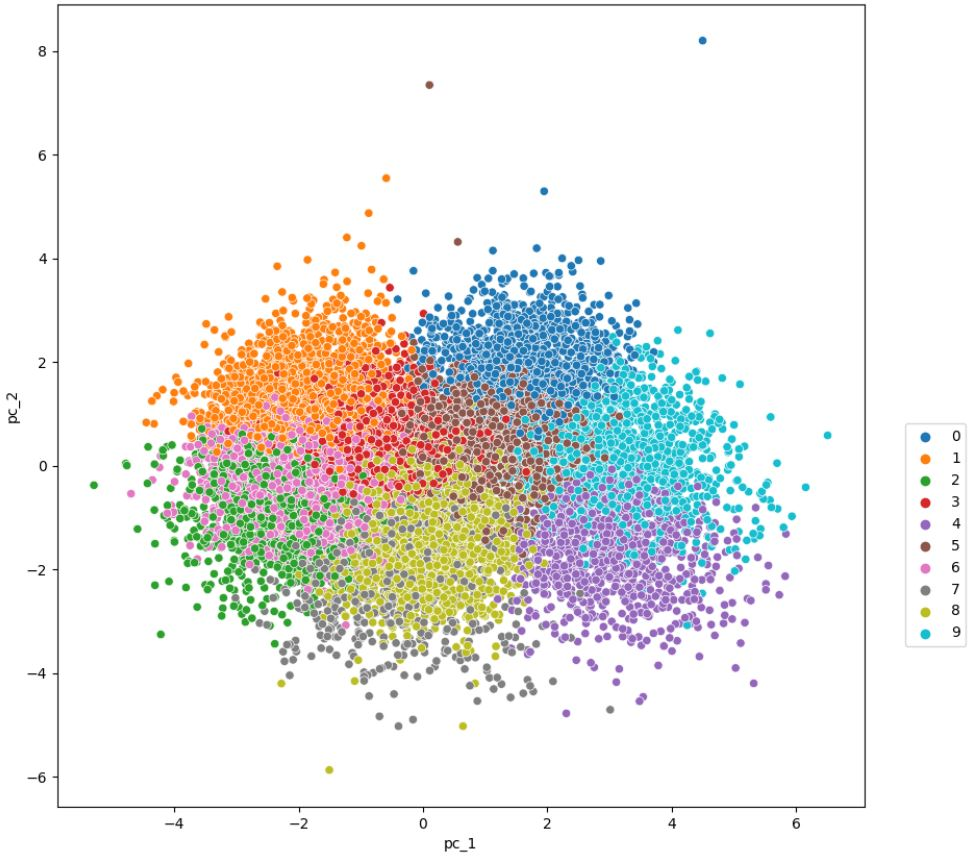   

<li>The above figure most clusters seem to be seperated which means a if we needed to conduct a superviced ML algorithm we would not be faced with many issues </li>
<li>
The following clusters could cause an issue due to their overlapping: The red (3) and brown (5) clusters & The grey (7) and the olive (8) clusters
</li>

</ul>

</li>

<li> When N=2 in PCA  and the hue is Clusters & styles is the gender feature

<ul>

   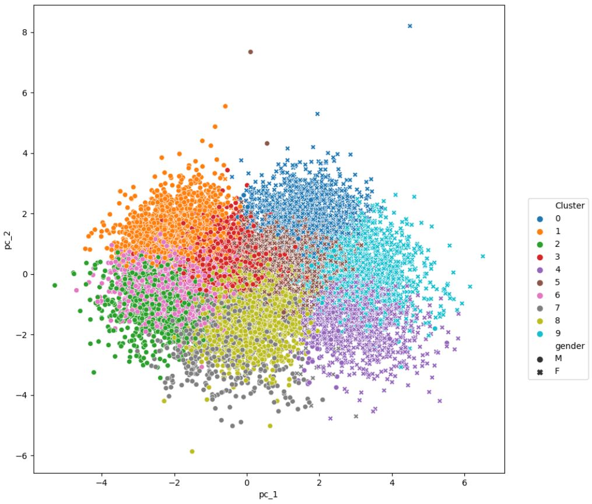   

<li>The above figure attempts to classifies the data further by adding the "gender" feature as a style</li>
<li>
Clusters orange (1), green (2), red (3), pink (6), grey (7), olive (8) seem to mainly contain males
</li>
<li>
Clusters grey (7) and purple (4) seem to contain both males and females. However, majority of the grey cluster are males and majority of the purple cluster are females
</li>
<li>
Clusters blue (0), light blue (9), purple (4), brown (5) seem to mainly contain females
</li>
<li>
PCA was able to separate the data based on gender without having the data being trained on gender. There is not any cluster that is highly divided in its numbers when it comes to males and females

</li>
</ul>

</li>

<li> When N=2 in PCA  and the hue is Clusters & styles is the clss feature

<ul>

      

<li>The above figure utilizes the styles option to indicate the different performance classes. A being class with the best performance and D being the worst </li>
<li>
Majority of clusters seem to share two classes at the same time             </li>
<li>
Cluster 0 the blue cluster seems to mainly have the A and B classes of data             </li>
<li>
Cluster 1 the orange cluster seems to mainly have the A and B classes of data
</li>
<li>
Cluster 2 the green cluster seems to share all classes but with majority being in class D
</li>
<li>
Cluster 3 the red cluster this cluster is difficult to have a conclusion for due to the fact it is extremely being overlapped by the other clusters
</li>
<li>
Cluster 4 the purple cluster this cluster seems to mainly include data from the D class and few others from the C class
</li>
<li>
Cluster 5 the brown cluster this cluster seems to have a mixture of classes but mainly classes A and B
</li>
<li>
Cluster 6 the pink cluster this cluster seems to have a mixture of classes but mainly classes A and B
</li>
<li>
Cluster 7 the grey cluster this cluster seems to mainly include data from class D
</li>
<li>
Cluster 8 the olive cluster this cluster seems to include all the classes equally
</li>
<li>
Cluster 9 the light blue cluster it seems to include all classes however there is a strong presence of classes C and D
</li>
<li>
PCA was able to separate the data based on performance class without having the data being trained on that feature
</li>
</ul>

</li>

</ul>

</ul>

</body>

</html>
